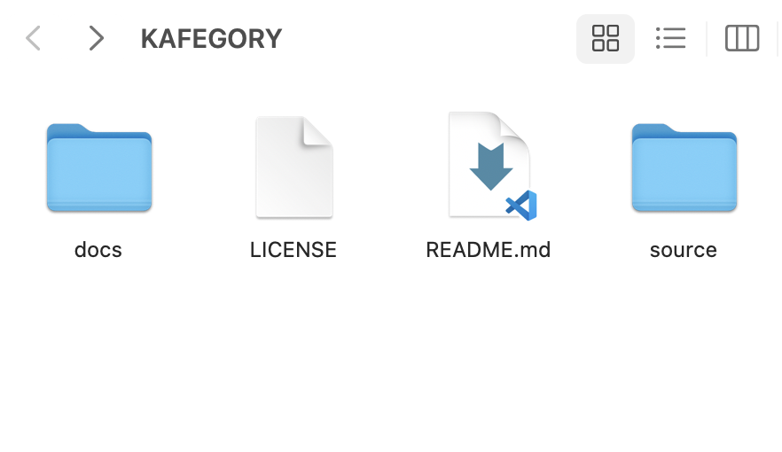

##################
Getting Start
##################

Download our project on GitHub
==============================

* To start, sign in to GitHub and navigate to the K-afegory-Opinion-Mining-by-Sentiment-Analysis-Based-on-Naver-Blog, where you will see a green ``Code`` button.
* After that, click on the ``Download ZIP`` category button.
* If you follow this procedure to download the compressed download folder, you will see the following files :
``docs`` 
    This is a folder containing documents written in 'reStructuredText' for our open source project.
    
``source``
    It contains our project's web source file and sentiment analysis source file.

``LICENSE``
    Apache License Version 2.0
    
``README.md``
    Basic description of our open source project, you will leave it untouched.

.. image:: capture_git.png

Use our project for your work
==============================

Our project has a huge range of applications. 
If our project fits the field you want to use, apply it now.

